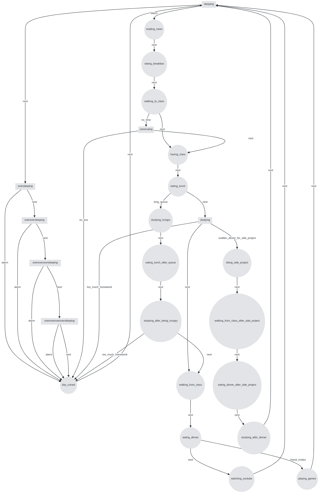

# Lab3 - automaton for my day

## Description

This is a simple automaton for my day. It is a finite state machine that has some states and transitions between them

## How to use

There are 3 modules: `automaton.py`, `day.py`, `my_day.py`

The first two are abstractions. To use my day automaton, you need to import `my_day.py`.

Then simpy run

```python
my_day = MyDay()
my_day.start_day()
```

and follow the instructions

Alternatively, if you don't want to use the ui provided, you can manually use the method `make_transition()` with a transition name or list of transition names for automaton to make

## Diagram



See [diagram.html](./diagram.png) for a closer look

## Available transitions

### `sleeping`

- `alarm` -> `reading_news`
- `next` -> `oversleeping`

### `oversleeping`

- `alarm` -> `day_ruined`
- `next` -> `overoversleeping`

### `overoversleeping`

- `alarm` -> `day_ruined`
- `next` -> `overoveroversleeping`

### `overoveroversleeping`

- `alarm` -> `day_ruined`
- `next` -> `overoveroveroversleeping`

### `overoveroveroversleeping`

- `alarm` -> `day_ruined`
- `next` -> `day_ruined`

### `reading_news`

- `next` -> `eating_breakfast`

### `eating_breakfast`

- `next` -> `walking_to_class`

### `walking_to_class`

- `next` -> `having_class`
- `no_time` -> `commuting`

### `commuting`

- `next` -> `having_class`
- `no_bus` -> `day_ruined`

### `having_class`

- `next` -> `eating_lunch`

### `eating_lunch`

- `next` -> `studying`
- `long_queue` -> `studying_hungry`

### `studying_hungry`

- `next` -> `eating_lunch_after_queue`

### `eating_lunch_after_queue`

- `next` -> `studying_after_being_hungry`

### `studying`

- `next` -> `walking_from_class`
- `too_much_homework` -> `day_ruined`
- `sudden_desire_for_side_project` -> `doing_side_project`

### `studying_after_being_hungry`

- `next` -> `walking_from_class`
- `too_much_homework` -> `day_ruined`

### `doing_side_project`

- `next` -> `walking_from_class_after_side_project`

### `walking_from_class`

- `next` -> `eating_dinner`

### `walking_from_class_after_side_project`

- `next` -> `eating_dinner_after_side_project`

### `eating_dinner`

- `next` -> `watching_youtube`
- `friend_invites` -> `playing_games`

### `eating_dinner_after_side_project`

- `next` -> `studying_after_dinner`

### `studying_after_dinner`

- `next` -> `sleeping`

### `watching_youtube`

- `next` -> `sleeping`

### `playing_games`

- `next` -> `sleeping`

### `day_ruined`

- `next` -> `sleeping`
